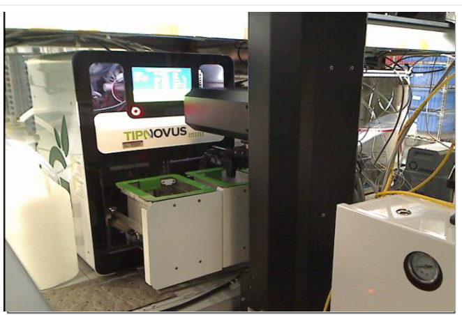
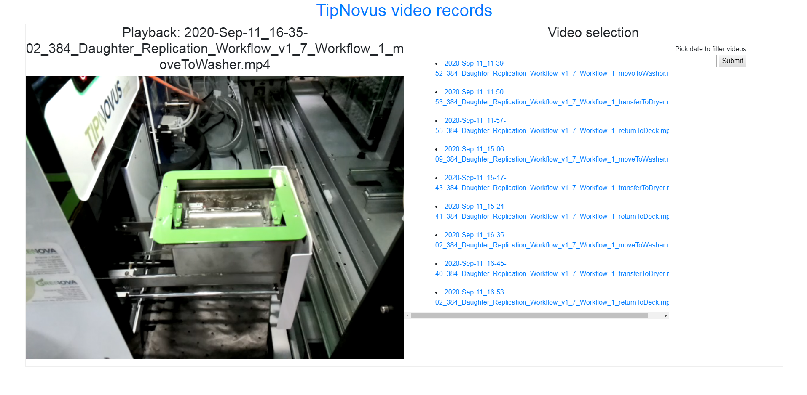
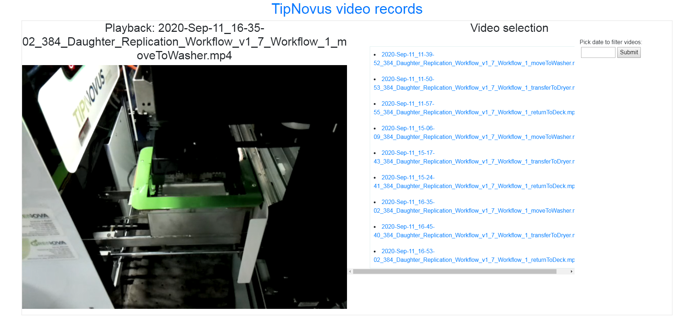
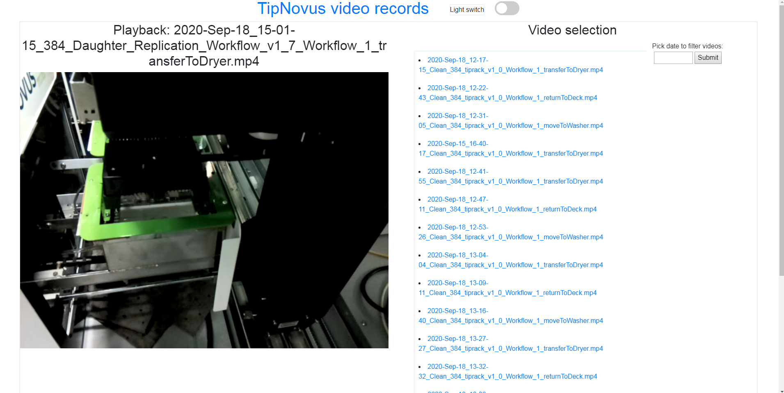

## Integration API for TipNovus tip washer in Hamilton Vantage Robotic Liquid Handler

The API is hosted on a **raspberry pi 4** running flask on the backend. The app allows users to get liquid level sensor data real-time and monitors reagent carboys with coloured LEDS. A pi-camera is installed which can stream data on an endpoint or save a video for a particular time-frame.

#### Installing packages on raspberry p:

first create a virtual environment, `python3 -m venv env`. Then source the
virtual environment with, `source /env/bin/activate`. Then install all packages
from `requirements.txt` using the command: `pip install -r /path/to/requirements.txt`. In order to install the Phidget22 library, enter the following commands: 

```
sudo apt-get install libusb-1.0.0-dev
cd
curl -LO https://www.phidgets.com/downloads/phidget22/libraries/linux/libphidget22.tar.gz
tar -xvzf libphidget22.tar.gz
cd libphidget22-1.6.20201023
./configure
make
sudo make install
```
restart the terminal and then update the library cache: `sudo ldconfig`

Navigate to the `libphidget22-1.6.20201023/plat/linux/udev` directory. In order
to allow your programs to access the phidgets connected to your Raspberry Pi,
you need to configure the device rules.

You can do this by entering the following command: `sudo cp
99-libphidget22.rules /etc/udev/rules.d/`. Then reboot the rpi


#### Calling the api can be done using `curl`:

getting the status of the washer compartment: `curl http:{$hostname}:5000/tp_ser_wbsrv/dply_wash -X PUT` where `$hostname` is the name of the current host (computer). A json response will be
outputted in the terminal, such as: 

      { 
      "cmd": "dply_wash", 
      "code_cmd": "01,TI,WA,WS,#", 
      "response" : "01,ACK,00,#", 
      "interpretation": "washer compartment is not in operation" 
      }

OR ... running the python script (`read_response_api.py` which uses argparse) through the terminal: 

`python read_response_api.py -e dply_wash -t put` 

typing `curl http:{$hostname}:5000/tp_ser_wbsrv/cmds -X GET` will list all the available valid commands. Streaming video can be done typing: `http://{$hostname}:5000/tp_ser_wbsrv/` into a browser where one can view live video stream from the picamera. There is also a lamp controlled by the raspberry pi to turn on and off in order for the picamera to capture the robotic arm placing and removing the rack of tips to clean. Some of the images below show the GUI interface of the webapp. 

#### Screenshots

- serial device (tip cleaning)


- tipnovus machine with door open 


- robotic arm placing tip rack for cleaning


- additional images 


*Project completed for integrating the Grenova TipNovus mini tip cleaner into a Hamilton Vantage.*
